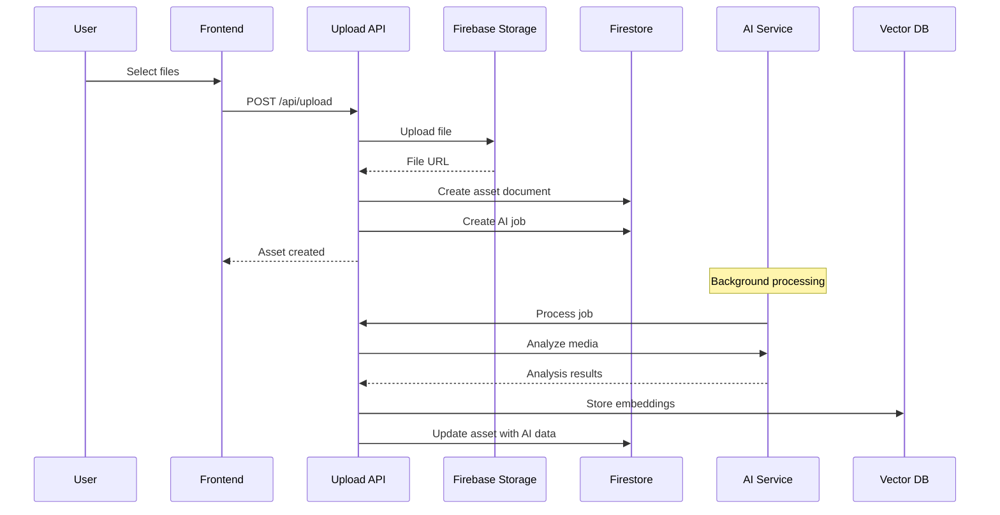
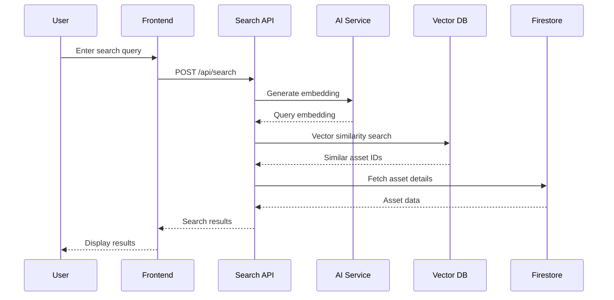
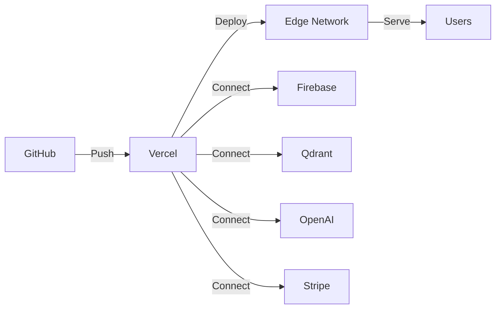

# Neural Salvage Architecture

## System Overview

Neural Salvage is a full-stack web application built with Next.js 15, Firebase, and AI services. It provides an AI-powered media management platform with semantic search, marketplace features, and intelligent organization.

## Architecture Diagram

```mermaid
graph TB
    subgraph "Client Layer"
        A[Next.js Frontend]
        B[React Components]
        C[Auth Context]
        D[State Management]
    end
    
    subgraph "API Layer"
        E[Next.js API Routes]
        F[/api/upload]
        G[/api/ai/analyze]
        H[/api/search]
        I[/api/marketplace]
    end
    
    subgraph "Services Layer"
        J[AI Provider Service]
        K[Vector Service]
        L[Storage Service]
        M[Payment Service]
    end
    
    subgraph "External Services"
        N[Firebase Auth]
        O[Firestore]
        P[Firebase Storage]
        Q[OpenAI/xAI]
        R[Qdrant]
        S[Stripe]
    end
    
    A --> E
    B --> C
    C --> D
    E --> F
    E --> G
    E --> H
    E --> I
    F --> L
    G --> J
    H --> K
    I --> M
    J --> Q
    K --> R
    L --> P
    M --> S
    C --> N
    E --> O
```

## Data Flow

### Upload Flow


### Search Flow


## Component Architecture

### Frontend Components

```
app/
├── (auth)/
│   ├── login/
│   └── signup/
├── dashboard/
├── gallery/
├── collections/
├── marketplace/
├── profile/
└── settings/

components/
├── ui/              # shadcn/ui components
├── layout/          # Layout components
├── media/           # Media display components
├── upload/          # Upload components
└── search/          # Search components

contexts/
├── AuthContext.tsx
└── MediaContext.tsx

hooks/
├── useAuth.ts
├── useUpload.ts
└── useSearch.ts
```

### Backend Services

```
lib/
├── firebase/
│   ├── config.ts    # Client SDK
│   └── admin.ts     # Admin SDK
├── ai/
│   └── providers.ts # AI abstraction
├── vector/
│   └── qdrant.ts    # Vector DB
└── stripe/
    └── connect.ts   # Payments
```

## Database Schema

### Firestore Collections

#### Users
```typescript
{
  id: string;
  email: string;
  username: string;
  displayName?: string;
  avatar?: string;
  bio?: string;
  socialLinks?: {
    twitter?: string;
    github?: string;
    website?: string;
  };
  stripeAccountId?: string;
  plan: 'free' | 'pro';
  aiUsage: {
    current: number;
    limit: number;
    resetDate: Date;
  };
  createdAt: Date;
  updatedAt: Date;
}
```

#### Assets
```typescript
{
  id: string;
  userId: string;
  filename: string;
  originalFilename: string;
  type: 'image' | 'video' | 'audio' | 'document';
  mimeType: string;
  size: number;
  url: string;
  thumbnailUrl?: string;
  dimensions?: { width: number; height: number };
  duration?: number;
  uploadedAt: Date;
  updatedAt: Date;
  aiAnalysis?: {
    caption?: string;
    tags: string[];
    colors?: string[];
    nsfw?: boolean;
    nsfwScore?: number;
    ocr?: string;
    transcript?: string;
    embedding?: number[];
    analyzedAt: Date;
  };
  collectionIds: string[];
  visibility: 'private' | 'public';
  forSale: boolean;
  price?: number;
  license?: 'personal' | 'commercial' | 'exclusive';
  sold: boolean;
  metadata: Record<string, any>;
}
```

#### Collections
```typescript
{
  id: string;
  userId: string;
  name: string;
  description?: string;
  coverImageId?: string;
  assetIds: string[];
  visibility: 'private' | 'public';
  createdAt: Date;
  updatedAt: Date;
}
```

#### Jobs
```typescript
{
  id: string;
  userId: string;
  assetId: string;
  type: 'analyze_image' | 'analyze_video' | 'generate_embedding' | 'transcribe_audio';
  status: 'pending' | 'processing' | 'completed' | 'failed';
  progress: number;
  result?: any;
  error?: string;
  retryCount: number;
  createdAt: Date;
  updatedAt: Date;
  completedAt?: Date;
}
```

#### Sales
```typescript
{
  id: string;
  assetId: string;
  sellerId: string;
  buyerId: string;
  amount: number;
  platformFee: number;
  sellerAmount: number;
  stripePaymentIntentId: string;
  status: 'pending' | 'completed' | 'refunded';
  deliveryUrl?: string;
  deliveryExpiresAt?: Date;
  createdAt: Date;
  completedAt?: Date;
}
```

### Vector Database (Qdrant)

```typescript
Collection: neural_salvage_assets
Vector Size: 1536 (text-embedding-3-small)
Distance: Cosine

Point Structure:
{
  id: assetId,
  vector: number[1536],
  payload: {
    userId: string,
    type: string,
    tags: string[],
    caption?: string,
    forSale?: boolean
  }
}
```

## Security Architecture

### Authentication
- Firebase Authentication with multiple providers
- JWT tokens for API authentication
- Session management with cookies

### Authorization
- Firestore security rules for data access
- Storage security rules for file access
- API middleware for route protection

### Data Protection
- HTTPS-only in production
- Signed URLs for file delivery
- Rate limiting on API endpoints
- Input validation and sanitization

## Scalability Considerations

### Performance
- Next.js static generation where possible
- Image optimization with Next.js Image
- Lazy loading for media galleries
- Pagination for large datasets

### Caching
- Browser caching for static assets
- CDN for media files (Firebase Storage)
- API response caching where appropriate

### Background Processing
- Job queue for AI processing
- Retry logic with exponential backoff
- Progress tracking for long operations

## Deployment Architecture



### Infrastructure
- **Hosting**: Vercel (Next.js optimized)
- **Database**: Firebase Firestore (managed)
- **Storage**: Firebase Storage (managed)
- **Vector DB**: Qdrant Cloud (managed)
- **CDN**: Vercel Edge Network

### CI/CD
- Automatic deployments from main branch
- Preview deployments for pull requests
- Environment variable management in Vercel
- Build optimization and caching

## Monitoring & Observability

### Logging
- Client-side error tracking
- Server-side API logging
- Firebase Analytics integration

### Metrics
- Upload success/failure rates
- AI processing times
- Search performance
- User engagement metrics

### Alerts
- Failed AI processing jobs
- Storage quota warnings
- Payment processing errors
- Security incidents

## Future Enhancements

### Planned Features
- Real-time collaboration
- Advanced AI filters and effects
- NFT minting integration
- Mobile applications
- Advanced analytics dashboard

### Technical Improvements
- GraphQL API layer
- Redis caching layer
- Microservices architecture
- Kubernetes deployment
- Multi-region support